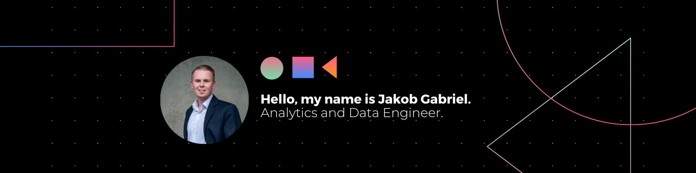

# 👋 Hello, I'm Jakob Gabriel!

## About Me

📊 Analytics  | 🔍 Data Engineer

I am an experienced Analytics and Data Engineer with a passion for Industry 4.0, advanced analytics, and data-driven decision-making. My expertise lies in translating manufacturing challenges into actionable insights through data analysis and automation.

## Experience

### Analytics and Data Engineer at ContiTech Techno-Chemie GmbH (Jan 2022 – Present)

🚀 I work on developing and defining analytics use cases and projects for Mobile Fluid Systems' production processes.  
🔍 Execute continuous improvement processes using data-driven problem-solving techniques.  
📈 Automate analytics and operational workflows to accelerate results discovery.  
📊 Prepare budgets, document solutions, and collaborate across functions.

### Quality Engineer at ContiTech MGW GmbH (Oct 2018 – Dec 2021)

🔍 Monitored corrective measures, evaluated customer requirements, and coordinated improvement actions.  
📋 Created and maintained test instructions, control plans, and flow charts.  
🛠️ Participated in FMEA meetings, risk analysis, and internal process series.  
💡 Introduced continuous improvement actions to reduce quality costs.

## Skills

### Industry Knowledge

🏭 Industry 4.0 Management and Strategy  
📊 Manufacturing Intelligence / Analytics / Data Science  
💹 Financial Management for Industry 4.0 Implementations  
📊 Advanced Analytics Methodologies  

### Languages

🇩🇪 German: ★★★  
🇬🇧 English: ★★☆  

## Key Skills 🛠️

<table>
    <tr>
        <td align="center" style="border:1px solid #3A424A">
            
             
            MS Project
        </td>
        <td align="center" style="border:1px solid #3A424A">
            
             
            MS Planner
        </td>
        <td align="center" style="border:1px solid #3A424A">
            
             
            GitLab
        </td>
        <td align="center" style="border:1px solid #3A424A">
            
             
            FMEA Moderation
        </td>
    </tr>
    <tr>
        <td align="center" style="border:1px solid #3A424A">
            
             
            Minitab
        </td>
        <td align="center" style="border:1px solid #3A424A">
            
             
            Python
        </td>
        <td align="center" style="border:1px solid #3A424A">
            
             
            KNIME
        </td>
        <td align="center" style="border:1px solid #3A424A">
            
             
            Postgres
        </td>
    </tr>
    <tr>
        <td align="center" style="border:1px solid #3A424A">
            
             
            Timescale
        </td>
        <td align="center" style="border:1px solid #3A424A">
            
             
            InfluxDB
        </td>
        <td align="center" style="border:1px solid #3A424A">
            
             
            Cassandra
        </td>
        <td align="center" style="border:1px solid #3A424A">
            
             
            Grafana
        </td>
    </tr>
    <tr>
        <td align="center" style="border:1px solid #3A424A">
            
             
            Superset
        </td>
        <td align="center" style="border:1px solid #3A424A">
            
             
            PowerBI
        </td>
    </tr>
</table>

## Education

🎓 Master of Engineering in Applied Polymer Engineering  
🏛️ [University of Applied Sciences Schmalkalden](https://www.hsmfernstudium.de/masterstudiengaenge/angewandte-kunststofftechnik-meng)  

🎓 Bachelor of Engineering in Polymer Engineering  
🏛️ [Duale Hochschule Gera Eisenach](https://www.dhge.de/DHGE/Studiengaenge/Technik/Kunststofftechnik.html)  

## Certificates / Training

📜 Advanced Analytics Methodologies - [AdvancedAnalytics.Academy GmbH](https://advancedanalytics.academy/trainings/fundamentals/advancedanalytics-methodologies)  
📜 Product Auditor VDA 6.5 - [TÜV Hessen](https://www.tuev-club.de/656/tuev-know-how-club-seminare/)

## Github Stats 📈

  
  

## Connect with Me 🔗

