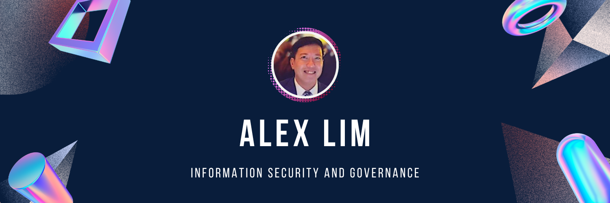

 

<h1>🙆 Talking about Personal Stuffs...</h1>

<!-- ABOUT -->
## About Me

- 👨‍💼 Leader in Information Security and Governance
- 🔒 Passionate about ethical hacking and data protection
- 🕵️‍♀️ Skilled in Endpoint Detection and Response
- 📊 Experienced in GRC and Data Governance
- 👨‍💻 Knowledgeable in IT Audit
- ⚠️ Proficient in Risk Assessment and Management

 

<!-- SKILLS -->
## Skills

- 💻 Information Security and Governance
- 🛡️ Ethical Hacking
- 🔒 Data Protection & Data Privacy
- 🔍 Endpoint Detection and Response
- 📈 GRC
- 📊 Data Governance
- 📝 IT Audit
- ⚖️ Risk Assessment and Management

 

<!-- GITHUB STATS -->

  

 

<!-- TOOLS AND LANGUAGE -->
## Tools and Technologies
<table>
  <tbody>
    <tr>
      <td align="center" style="border:1px solid #3A424A">
        
         Python
      </td>
      <td align="center" style="border:1px solid #3A424A">
        
         JavaScript
      </td>
      <td align="center" style="border:1px solid #3A424A">
        
         Java
      </td>
      <td align="center" style="border:1px solid #3A424A">
        
         PowerShell
      </td>
      <td align="center" style="border:1px solid #3A424A">
        
         Bash
      </td>
      <td align="center" style="border:1px solid #3A424A">
        
         Trend Micro  
      </td>
      <td align="center" style="border:1px solid #3A424A">
        
         IBM Guardium  
      </td>
      <td align="center" style="border:1px solid #3A424A">
        
         CyberArk 
      </td>
      <td align="center" style="border:1px solid #3A424A">
        
         Zscaler 
      </td>
      <td align="center" style="border:1px solid #3A424A">
        
         AWS Security 
      </td>
      <td align="center" style="border:1px solid #3A424A">
        
         Technology Risk 
      </td>
</tr>
  </tbody>
</table>

 

## Connect with me:

 

 

 </a>

 

 
<b>Visitors Count</b>
  

 
 

<!--  -->
