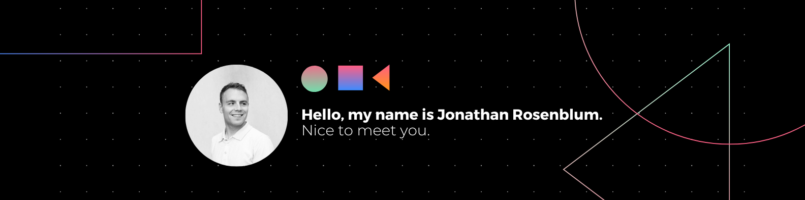

👋 Hi there! I'm Jon Rosenblum, a passionate software developer based in New York, NY. Let's embark on a journey through my software development endeavors! 🚀

## About Me 😃
I am driven by a deep desire to solve complex problems through the power of software development and engineering principles. My goal is to create software solutions that cater to the needs of businesses, organizations, and end-users alike.

## Experience 💼
### Jr. Web Developer, CRAZE (April 2018 - May 2021)
- ✍️ Crafted clean, efficient, and well-documented code using HTML, CSS, and JavaScript.
- 🤝 Collaborated with design teams to bring captivating visual designs to life on functional web pages.
- 🚀 Developed and implemented website features like forms, search bars, and interactive elements.
- 🛠️ Thoroughly tested and debugged websites to ensure smooth functionality across various devices and browsers.
- 🔄 Updated and maintained existing websites with fresh content, features, and functionalities.
- 📚 Stayed ahead of the curve with the latest web development trends and technologies.

### Retail Business Consultant, Morton’s Official Camp Outfitter (May 2020 - October 2022)
- 🌐 Created a revenue-generating e-commerce site (www.mortonscedarhurst.com).
- 📦 Managed online orders and inventory allocation for seamless online purchases.

## Key Skills 🛠️
<table>
    <tr>
        <td align="center" style="border:1px solid #3A424A">
            
             
        </td>
        <td align="center" style="border:1px solid #3A424A">
            
             
        </td>
        <td align="center" style="border:1px solid #3A424A">
            
             
        </td>
        <td align="center" style="border:1px solid #3A424A">
            
             
        </td>
    </tr>
    <tr>
        <td align="center" style="border:1px solid #3A424A">
            
             
        </td>
        <td align="center" style="border:1px solid #3A424A">
            
             
        </td>
        <td align="center" style="border:1px solid #3A424A">
            
             
        </td>
        <td align="center" style="border:1px solid #3A424A">
            
             
        </td>
    </tr>
    <tr>
        <td align="center" style="border:1px solid #3A424A">
            
             
        </td>
        <td align="center" style="border:1px solid #3A424A">
            
             
        </td>
        <td align="center" style="border:1px solid #3A424A">
            
             
        </td>
        <td align="center" style="border:1px solid #3A424A">
            
             
        </td>
    </tr>
    <tr>
        <td align="center" style="border:1px solid #3A424A">
            
             
        </td>
        <td align="center" style="border:1px solid #3A424A">
            
             
        </td>
        <td align="center" style="border:1px solid #3A424A">
            
             
        </td>
        <td align="center" style="border:1px solid #3A424A">
            
             
        </td>
    </tr>
    <tr>
        <td align="center" style="border:1px solid #3A424A">
            
             
        </td>
        <td align="center" style="border:1px solid #3A424A">
            
             
        </td>
        <td align="center" style="border:1px solid #3A424A">
            
             
        </td>
    </tr>
</table>

## Education 🎓
- 🎓 Bachelor of Arts in Sociology, University of Georgia, January 2021 - May 2023
- 💻 Software Engineering Boot Camp, Flat Iron School - New York City, June 2023 - October 2023 (expected)
- 🖥️ Full Stack Developer Boot Camp, Columbia Engineering, September 2022
- 🎓 Bachelor of Science in School of Information, University of Michigan - Ann Arbor, September 2016 - May 2020

## Certifications 🏆
- ☁️ AWS Cloud Practitioner
- 💻 Full-Stack Developer (Columbia Engineering)

## Github Stats 📈

  
  

## Connect with Me 🔗

