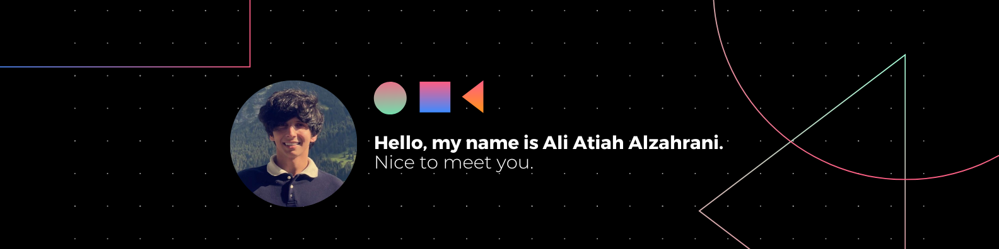

# 👋 Hello, I'm Ali Atiah Alzahrani!

🧠 Data Scientist | 📊 Analytics & Modeling | 🌐 Portfolio Optimization | 🛡️ Risk Mitigation

## 🚀 Selected Projects

1. 📈 **AI-based Risk Modelling**: Leveraged CVaR and Stochastic Volatility Models for risk assessment.
   - Skills: Probabilistic Methods, Deep Learning, Python.

2. 🤖 **Financial Trading Bot**: Developed using Deep Q-Networks and Semantic Analysis.
   - Skills: Deep Reinforcement Learning, NLP, Python.

3. 📊 **Portfolio Optimization**: Conducted Comparative Analysis of SVM, Random Forest, and XGBoost.
   - Skills: Machine Learning, Predictive Models, Python.

## 💼 Experience

- **Independent AI Researcher** at GoFar.ai (2022 - Present)
   Freelance AI researcher focusing on ML, NLP, Computer Vision, and DRL.

- **Founder, Quantitative Investment Manager** at Sparsfolio (2015 - 2022)
   Utilized AI and Quantitative Finance for optimizing investment strategies.

- **Researcher** at KACARE (2014 - 2015)

## 📚 Education

- **Artificial Intelligence Postgraduate Professional Program** at Stanford (2020 - 2021)

- **MSc in Electrical Engineering** (Sparse Signal Processing) at KAUST (2012 - 2014)
  Published research in IEEE International Conference in Acoustic and Speech Signal Processing (ICASSP).

- **BSc in Electrical Engineering (First Honors)** at KFUPM (2008 - 2012)

## Key Skills 🛠️
<table>
    <tr>
        <td align="center" style="border:1px solid #3A424A">
            
             
            HTML
        </td>
        <td align="center" style="border:1px solid #3A424A">
            
             
            CSS
        </td>
        <td align="center" style="border:1px solid #3A424A">
            
             
            JavaScript
        </td>
        <td align="center" style="border:1px solid #3A424A">
            
             
            Bash
        </td>
    </tr>
    <tr>
        <td align="center" style="border:1px solid #3A424A">
            
             
            Python
        </td>
        <td align="center" style="border:1px solid #3A424A">
            
             
            SQL
        </td>
        <td align="center" style="border:1px solid #3A424A">
            
             
            PHP
        </td>
        <td align="center" style="border:1px solid #3A424A">
            
             
            MVC
        </td>
    </tr>
    <tr>
        <td align="center" style="border:1px solid #3A424A">
            
             
            Java
        </td>
        <td align="center" style="border:1px solid #3A424A">
            
             
            C
        </td>
        <td align="center" style="border:1px solid #3A424A">
            
             
            C#
        </td>
        <td align="center" style="border:1px solid #3A424A">
            
             
            Assembly
        </td>
    </tr>
</table>

## 📜 Certificates

- Machine Learning (Cornell University)
- AI for Trading Nanodegree (Udacity)
- Deep Learning Nanodegree (Udacity)
- Programming for Data Science with Python (Udacity)

## Github Stats 📈

  
  

## Connect with Me 🔗

