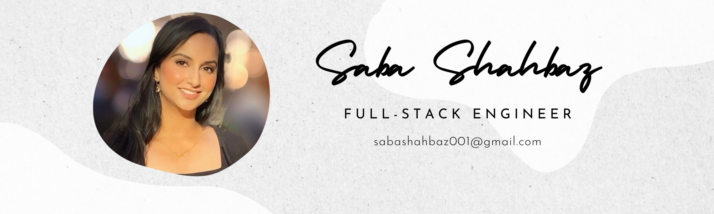

# 👋 Hello, I'm Saba Shahbaz

## 🚀 Objective
Experienced full-stack software engineer with a strong background in biological sciences. Passionate about creating web applications using JavaScript, React.js, Python, Flask, SQL, HTML, and CSS.

## 🎓 Education
- Full-Stack Software Engineering Certificate from Flatiron School, NY 🚀
- MA in Biological Sciences from Queens College, NY 📖
- BS in Biological Sciences from Binghamton University, NY 🎓

## 💻 Technical Skills

<table>
    <tr>
        <td align="center" style="border:1px solid #3A424A">
            
             Python
        </td>
        <td align="center" style="border:1px solid #3A424A">
            
             Flask
        </td>
        <td align="center" style="border:1px solid #3A424A">
            
             SQL
        </td>
        <td align="center" style="border:1px solid #3A424A">
            
             SQLAlchemy
        </td>
    </tr>
    <tr>
        <td align="center" style="border:1px solid #3A424A">
            
             JavaScript
        </td>
        <td align="center" style="border:1px solid #3A424A">
            
             React.js
        </td>
        <td align="center" style="border:1px solid #3A424A">
            
             HTML
        </td>
        <td align="center" style="border:1px solid #3A424A">
            
             CSS3
        </td>
    </tr>
</table>
 

## 💼 Work Experience
- Medical Assistant/Scribe at StatMD Urgent Care, NY 🏥
- Physics Teaching Assistant at Binghamton University 📚
  
## 🧬 Background
- Full-Stack Software Engineer 💻
- Master's in Biological Sciences 🧪
- BSc in Biological Sciences 🌿
- New Yorker 🗽

## 📈 Github stats

## Connect with me:

 

 

 
<b>Visitors Count</b>
  

 
 

